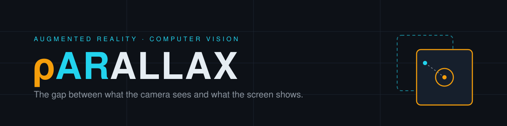

<p align="center">
  
</p>

<p align="center">
  
  
  
  
  
</p>

---

Point your phone at a real object, press and hold to **cut** it out of the world.
Point at your monitor and release to **paste** it into GIMP or Photoshop —
background already removed, landing where you pointed.

An AR + computer vision system that closes the gap between the physical desk and
the digital canvas.

> *Parallax* — the displacement of an object viewed along two different lines of
> sight. Reconciling those two views is precisely the problem this solves: a
> homography maps the camera's view of your monitor back into screen coordinates.

> **Status:** research prototype, actively being rebuilt.
> pARallax grew out of [cyrildiagne/ar-cutpaste](https://github.com/cyrildiagne/ar-cutpaste)
> (MIT, 2020) and has since been substantially rewritten — see
> [What's different](#whats-different-from-upstream).

---

## How it works

```
┌─────────────┐   photo    ┌──────────────┐   photo   ┌────────────────────┐
│  Mobile app │ ─────────► │ Local server │ ────────► │ Segmentation       │
│ (Expo / RN) │            │   (Flask)    │ ◄──────── │ u2net / BiRefNet   │
└─────────────┘   cutout   └──────────────┘   mask    └────────────────────┘
       │                          │
       │  photo of the monitor    │ screenshot + SIFT homography
       └────────────────────────► │        ▼
                                  │  screen coordinates
                                  │        ▼
                                  │  ┌──────────────────┐
                                  └─►│ GIMP (Script-Fu) │
                                     │ or Photoshop     │
                                     └──────────────────┘
```

**Cut** — the app captures a frame and POSTs it to the local server, which
forwards it to a background-removal service. The returned saliency mask is
composited into the alpha channel and the transparent PNG is sent back to the
phone (and cached for the paste step).

**Paste** — the app captures a frame containing the monitor. The server grabs a
screenshot, then uses SIFT keypoints + FLANN matching + a RANSAC homography to
work out *where on the screen* the camera was pointing. Those coordinates are
converted into a document-relative offset and the cached cutout is pasted into
the active document as a new layer, via a pluggable target (GIMP or Photoshop).

---

## Repository layout

```
app/                    Expo / React Native mobile client
  App.tsx               Camera view, press-to-cut / release-to-paste gesture
  components/
    Server.tsx          HTTP client for the local server
    ProgressIndicator.tsx  Animated SVG feedback overlay
    Base64.tsx          Base64 shim (no atob/btoa in React Native)
  utils/config.ts       Env-driven configuration

server/                 Flask local server
  src/
    main.py             HTTP API: /ping, /cut, /paste
    config.py           Env-driven configuration
    screenpoint.py      SIFT homography: locate camera view within screenshot
    targets/
      base.py           PasteTarget interface and coordinate-space notes
      gimp.py           GIMP via the Script-Fu server (TCP, cross-platform)
      photoshop.py      Photoshop via AppleScript (macOS only)
  tools/
    check_target.py     Diagnostic for whichever target is configured

segmentation/           Background-removal service (u2net / BiRefNet)
  service.py            HTTP API: mask and cutout endpoints
  config.py             Model tiers and inference tuning
  session.py            Provider selection with graceful degradation
  bench.py              Latency benchmark across models
```

---

## Setup

### Prerequisites

- **Python 3.10–3.12** and Node 18+
  <br>The upper bound is not cosmetic: `onnxruntime` ships no wheels for CPython
  3.13 or 3.14, and the segmentation service depends on it. On a Mac whose
  default `python3` is newer, `brew install python@3.12` and point each venv at
  that binary explicitly.
- A phone with the [Expo Go](https://expo.dev/go) app, on the **same Wi-Fi**
  as your computer
- An editor to paste into, with a document open — **[GIMP](https://www.gimp.org)**
  (free, any OS) or a licensed desktop Adobe Photoshop (macOS only; the web and
  Express tiers have no scripting interface)
- A reachable background-removal HTTP service (see below)

### 1. Segmentation service

Runs locally — no GPU and no third-party endpoint required. Defaults to `u2net`
(~750 ms); `birefnet-general-lite` gives better edges at ~10s.

```bash
cd segmentation
python3 -m venv venv
source venv/bin/activate
pip install -r requirements.txt
python service.py --preload
```

Listens on `:8081`, which is the local server's default, so the two connect with
no configuration. `--preload` downloads the model weights at startup instead of
stalling the first cut.

Full details, model options and benchmarking in [segmentation/](segmentation/).

> Upstream depended on a public CoreWeave U²-Net endpoint from 2020 that is no
> longer dependable. pARallax bundles its own service instead, so the project is
> self-contained.

### 2. Local server

```bash
cd server
python3 -m venv venv
source venv/bin/activate
pip install -r requirements.txt

cp .env.example .env      # then edit .env
python src/main.py
```

Verify it's alive: `curl http://localhost:8080/ping` — the response reports
which paste target is configured and whether it's reachable.

### 3. Mobile app

```bash
cd app
npm install

cp .env.example .env      # set EXPO_PUBLIC_SERVER_URL to your computer's LAN IP
npm start
```

Scan the QR code with Expo Go.

> `localhost` will not work from a physical device — you must use the LAN IP of
> the machine running the server (e.g. `http://192.168.1.29:8080`).

### 4. The editor

**GIMP** (default, free, cross-platform):

```bash
brew install --cask gimp     # or download from gimp.org
```

Open GIMP, create a document, then **Filters → Script-Fu → Start Server** and
click Start. It listens on `127.0.0.1:10008`.

> The Script-Fu server has **no authentication** — anything that can reach the
> port runs arbitrary code. Keep it on localhost.

> Two things will look broken and are not. The **Script-Fu Server Options window
> stays on screen permanently** — unresponsive, and its close button and Cancel
> do nothing — because the plugin never returns while serving. And **GIMP's UI
> goes sluggish**, since the server holds the main thread. Leave the window
> where it is; the socket works fine. Force-quitting GIMP is the only way to
> dismiss it, which also stops the server.

**Photoshop** (macOS only) — set `PASTE_TARGET=photoshop` and just have it open.

Either way, give the document a **non-blank background**. A blank canvas gives
SIFT too few features to match against, so the paste lands wrong or fails.

**macOS only:** grant your terminal **Screen Recording** permission in System
Settings > Privacy & Security > Screen & System Audio Recording, then fully quit
and reopen it. Without this, macOS silently returns screenshots containing only
the desktop wallpaper — no windows — and `/paste` fails with "screen not found"
for no visible reason.

Verify the bridge before going further:

```bash
python tools/check_target.py
```

---

## Configuration

All configuration is environment-driven. Nothing secret lives in source.

| Variable | Where | Default | Purpose |
|---|---|---|---|
| `SEGMENTATION_SERVICE_URL` | server | `http://localhost:8081` | Background-removal endpoint |
| `MODEL_NAME` | segmentation | `u2net` | Model — `u2net` fast, `birefnet-general-lite` higher quality |
| `PROVIDERS` | segmentation | `auto` | Execution providers (rembg ignores CoreML by default) |
| `POST_PROCESS_MASK` | segmentation | `true` | Morphological mask cleanup |
| `ALPHA_MATTING` | segmentation | `false` | Finer edges, slower on CPU |
| `SEGMENTATION_TIMEOUT` | server | `30` | Request timeout (seconds) |
| `SERVER_HOST` / `SERVER_PORT` | server | `0.0.0.0` / `8080` | Bind address |
| `CORS_ORIGINS` | server | `*` | Comma-separated allowed origins |
| `SAVE_DEBUG_IMAGES` | server | `false` | Dump intermediates to `server/tmp/` |
| `MAX_VIEW_SIZE` | server | `700` | Downscale cap for the camera frame |
| `MAX_SCREENSHOT_SIZE` | server | `400` | Downscale cap for the screenshot |
| `PASTE_TARGET` | server | `gimp` | `gimp` or `photoshop` |
| `PASTE_MAX_FRACTION` | server | `0.4` | Scale cutouts to this fraction of the canvas |
| `PASTE_ALLOW_UPSCALE` | server | `false` | Allow enlarging small cutouts |
| `GIMP_HOST` / `GIMP_PORT` | server | `127.0.0.1` / `10008` | GIMP Script-Fu server address |
| `PHOTOSHOP_APP_NAME` | server | *(auto-detect)* | Override e.g. `Adobe Photoshop 2025` |
| `EXPO_PUBLIC_SERVER_URL` | app | `http://localhost:8080` | Local server address |
| `EXPO_PUBLIC_REQUEST_TIMEOUT_MS` | app | `30000` | Client request timeout |

---

## API

| Method | Route | Body | Returns |
|---|---|---|---|
| `GET` | `/ping` | — | `{ status, message, segmentation_service }` |
| `POST` | `/cut` | multipart `data` (image) | `image/png` with alpha |
| `POST` | `/paste` | multipart `data` (image) | `{ status, x, y }` |

Errors return `{ "status": "error", "error": "<message>" }` with a meaningful
HTTP status. `/paste` returns `{ "status": "screen not found" }` (HTTP 200) when
the homography fails — this is an expected outcome, not an error.

---

## What's different from upstream

Upstream is a 2020 research prototype. pARallax:

- **Replaced the `screenpoint` dependency** with a local implementation
  (`server/src/screenpoint.py`) — inlier validation, bounds checking, tuned
  ratio/RANSAC thresholds, structured logging.
- **Modernised the stack** — Flask 3, OpenCV 4.9, Pillow 10, Expo SDK 50,
  React Native 0.73, TypeScript throughout.
- **Removed all hardcoded configuration** — the upstream fork carried a
  Photoshop password and a LAN IP in source. Everything is now env-driven.
- **Photoshop version auto-detection** instead of a pinned `"Adobe Photoshop 2025"`
  string, plus JSON-escaped script injection so filenames can't break the payload.
- **Real error handling** — CORS preflight, timeouts, upstream failure
  propagation, no silent `except: pass`.
- **Mobile UX** — animated SVG progress overlay, haptic feedback on cut/paste
  success and failure, in-app permission and connection errors.

---

## Known limitations

- **The Photoshop target is macOS only** and needs a licensed desktop install;
  the web and Express tiers expose no scripting interface. The GIMP target works
  anywhere and is free, which is why it is the default.
- **Paste placement is approximate.** Neither editor reports where its canvas
  sits on screen, so the pointed screen position is mapped proportionally onto
  the canvas rather than exactly. See `server/src/targets/base.py`.
- **Pasted cutouts are scaled**, not placed at native resolution — a 12 MP phone
  photo would otherwise overflow the canvas. Tune with `PASTE_MAX_FRACTION`.
- **GIMP's UI stalls while its Script-Fu server runs**, because the plugin holds
  the main thread. Pastes still apply; the canvas may need a manual redraw
  (View > Fit Image in Window).
- **SIFT is the weak link.** Low-texture screens, steep viewing angles and
  glare all cause "screen not found".
- The cut path crops to a **fixed centre region**, so framing matters.
- Paste assumes **fixed document dimensions**; other sizes drift.
- Requires a **round-trip to the segmentation service** per cut. Running it
  locally removes the internet dependency but CPU inference still costs time —
  benchmark your own machine with `segmentation/bench.py`.
- Fanless machines **thermally throttle** under repeated cuts.

---

## Roadmap

- [x] Self-hosted segmentation service — no GPU, no third-party endpoint
- [x] Measure latency across models on real hardware — see
      [segmentation/README](segmentation/README.md#measured-results)
- [x] Two-tier model choice: fast interactive default, opt-in quality mode
- [ ] Benchmark segmentation *accuracy* on a fixed test set (measured MAE /
      F-measure, not cited from papers)
- [ ] Find a quality model that runs in under 2s on CPU — BiRefNet cannot, and
      CoreML cannot compile it
- [ ] Swap SIFT for a learned matcher (LightGlue / LoFTR) to kill "screen not found"
- [ ] On-device inference (ONNX / CoreML / TFLite) — remove the server round-trip
- [ ] Exact canvas mapping — targets currently approximate, since neither editor
      reports its canvas rect on screen
- [x] Pluggable paste targets — GIMP (Script-Fu, cross-platform) and Photoshop
- [ ] Re-verify the Photoshop target against a licensed install
- [ ] More targets: Figma, Blender, system clipboard, local web canvas
- [ ] Interactive crop / refine step instead of the fixed centre crop
- [ ] Upgrade Expo SDK and migrate the deprecated `Camera` API to `CameraView`

---

## Credits

Built on [cyrildiagne/ar-cutpaste](https://github.com/cyrildiagne/ar-cutpaste) by
Cyril Diagne (MIT).

- **BiRefNet** — Zheng et al., *Bilateral Reference for High-Resolution Dichotomous
  Image Segmentation*, CAAI AIR 2024 — [code](https://github.com/ZhengPeng7/BiRefNet) (MIT)
- **rembg** — [danielgatis/rembg](https://github.com/danielgatis/rembg), model
  runtime and weight distribution (MIT)
- **BASNet** — Qin et al., *Boundary-Aware Salient Object Detection*, CVPR 2019
- **PiCANet** — Liu et al., *Learning Pixel-wise Contextual Attention*, CVPR 2018
- **FPN** — Lin et al., *Feature Pyramid Networks*, CVPR 2017
- Photoshop paste technique adapted from
  [RunwayML for Photoshop](https://github.com/runwayml/RunwayML-for-Photoshop)

Originally developed by Samarth Sharma as a Machine Learning project at the
School of Information Technology, Artificial Intelligence and Cyber Security,
Rashtriya Raksha University.

## License

MIT — see [LICENSE](LICENSE).
